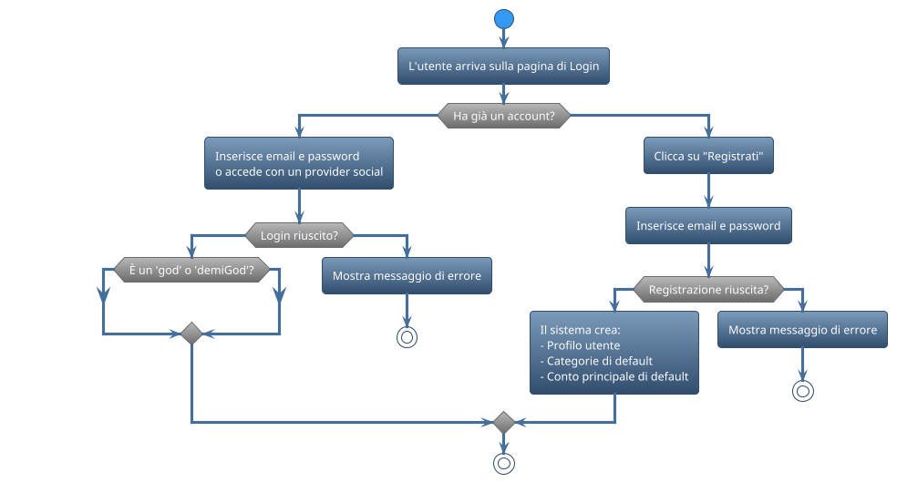

# Mappa dell'Esperienza Utente di BudgetWise

Questo documento descrive il flusso di navigazione e l'interazione dell'utente con le principali funzionalità dell'applicazione BudgetWise.

---

## 1. Onboarding: Il Primo Contatto

L'obiettivo è rendere l'ingresso dell'utente il più fluido e accogliente possibile.

---

## 2. Il Cuore dell'App: La Dashboard Utente (`/dashboard`)

Questa è la schermata principale, progettata per dare una visione d'insieme immediata della situazione finanziaria.

- **Riepilogo Saldo Totale:** Una card in evidenza mostra il saldo calcolato di tutti i conti.
- **Riepilogo Mensile:** Due card mostrano il totale delle entrate e delle uscite del mese corrente.
- **Riepilogo Budget:** Un carosello mostra lo stato di avanzamento dei budget attivi.
- **Grafici Principali:**
    - **Andamento Saldi:** Un grafico ad area mostra l'evoluzione storica del saldo totale.
    - **Entrate vs Uscite:** Un grafico a barre confronta le entrate e le uscite del mese.
- **Transazioni Recenti:** Una lista delle ultime operazioni inserite.
- **Consulente AI:** Un widget interattivo che fornisce consigli di risparmio personalizzati.
- **Pulsante Flottante (+):** Un'azione rapida per aggiungere una nuova transazione da qualsiasi punto della dashboard.

---

## 3. Gestione dei Conti (`/dashboard/accounts`)

Questa sezione permette all'utente di gestire le proprie fonti finanziarie.

- **Global Balance Header:** Un riepilogo del saldo totale che, se cliccato, espande il grafico dell'andamento storico di tutti i conti.
- **Lista Conti:** Ogni conto è rappresentato da una card che mostra:
    - Nome e icona.
    - Saldo attuale calcolato.
    - Numero di saldi storici registrati.
- **Azioni per Conto:** Un menu a tendina su ogni card permette di:
    - **Modificare:** Cambiare nome, icona e colore.
    - **Eliminare:** Rimuovere il conto e tutti i dati associati.
    - **Gestire Saldi Storici:** Navigare a una vista tabellare per modificare/aggiungere i saldi manualmente.
    - **Importare Transazioni/Saldi:** Aprire una modale per l'importazione massiva da file CSV.
- **Grafico di Andamento per Conto:** Ogni card può essere espansa per mostrare un grafico dedicato all'andamento del saldo di quel singolo conto.

---

## 4. Analisi e Dettaglio

### Cronologia Transazioni (`/dashboard/history`)

La vista completa di tutti i movimenti.

- **Filtri Potenti:** L'utente può filtrare le transazioni per:
    - Testo (descrizione, note).
    - Tipo (entrata/uscita).
    - Conto specifico.
    - Categoria specifica.
- **Tabella Dettagliata:** Una tabella elenca tutte le transazioni filtrate, mostrando tutti i dettagli rilevanti.
- **Esportazione:** Funzionalità per esportare i dati filtrati in formato CSV.

### Gestione Categorie (`/dashboard/categories`)

La personalizzazione dell'esperienza di tracciamento.

- **Vista a Tab:** Le categorie sono divise in "Uscite" ed "Entrate".
- **CRUD Categorie:** L'utente può creare nuove categorie (scegliendo nome, tipo, icona e colore), modificarle ed eliminarle.
- **AI per Icone:** Durante la creazione, l'AI suggerisce un'icona pertinente basandosi sul nome inserito.

---

## 5. Budget e Obiettivi (`/dashboard/budget`)

La sezione per la pianificazione proattiva.

- **Lista Budget:** Una griglia di "Budget Cards" mostra tutti i budget creati dall'utente.
- **Dettagli Card:** Ogni card visualizza:
    - Nome del budget.
    - Importo totale allocato vs. importo speso.
    - Barra di progresso percentuale.
    - Categorie incluse nel budget.
- **Creazione Budget con AI:**
    - Un pulsante "Crea Nuovo Budget" apre un form.
    - Un'opzione "Suggerisci con AI" analizza le transazioni passate per proporre un budget mensile realistico, pre-compilando i campi del form.

---

## 6. Profilo e Notifiche

- **Profilo Utente (`/dashboard/profile`):** Form per aggiornare le informazioni personali, la foto profilo e le preferenze (es. conto principale).
- **Centro Notifiche (`/dashboard/notifications`):** Un elenco di tutte le comunicazioni importanti, come le modifiche effettuate da un amministratore sul proprio account.

---
